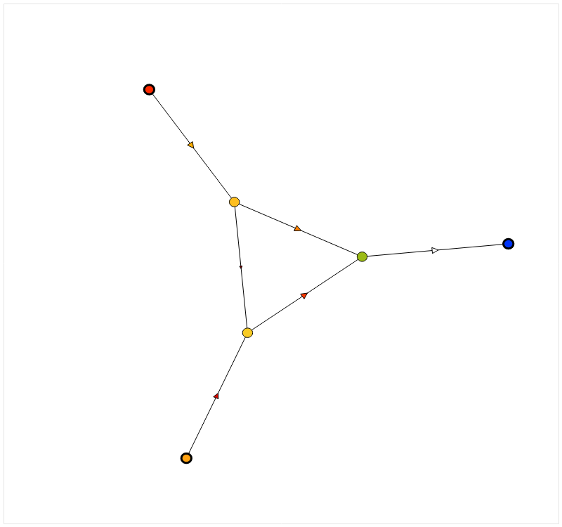
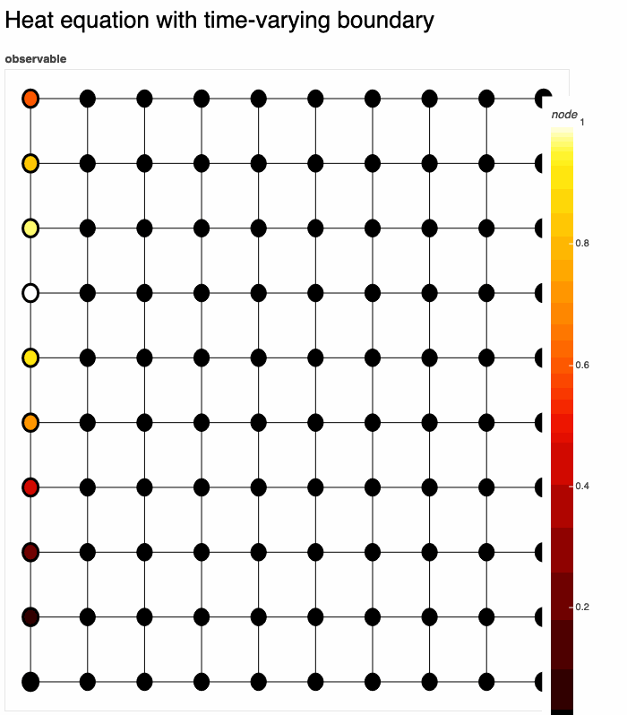

<!-- PROJECT LOGO -->
<br />
<p align="center">
  <a href="https://github.com/github_username/repo_name">
    
  </a>

  <h3 align="center">gds: graph dynamical systems library</h3>

  <p align="center">
    Simulate discrete- and continuous-time dynamics on networks, including PDEs, coupled map lattices, generalized cellular automata, and more.
    <br />
    <a href="https://a0s.co/docs/gds"><strong>Explore the docs [coming soon]»</strong></a>
  </p>
</p>


<!-- TABLE OF CONTENTS -->
<details open="open">
  <summary><h2 style="display: inline-block">Table of Contents</h2></summary>
  <ol>
    <li>
      <a href="#about">About</a>
      <ul>
        <li><a href="#features">Features</a></li>
      </ul>
    </li>
    <li>
      <a href="#getting-started">Getting Started</a>
      <ul>
        <li><a href="#prerequisites">Prerequisites</a></li>
        <li><a href="#installation">Installation</a></li>
      </ul>
    </li>
    <li><a href="#usage">Usage</a></li>
     <li><a href="#gallery">Gallery</a></li>
    <li><a href="#roadmap">Roadmap</a></li>
    <li><a href="#license">License</a></li>
    <li><a href="#references">References</a></li>
  </ol>
</details>


<!-- ABOUT THE PROJECT -->
## About

<p float="left">
  
   
  
</p>
<p float="left">
  
   
  
</p>


### Features

* Built directly on top of [NetworkX](https://networkx.org/); represent observables (currently) on vertices or edges 
* Spatial differential operators (gradient, divergence, laplace, advection) can be used in evolution laws, with more coming soon
* Support for time-varying [Dirichlet](https://en.wikipedia.org/wiki/Dirichlet_boundary_condition) and [Neumann](https://en.wikipedia.org/wiki/Neumann_boundary_condition) boundary conditions 
* Support for [kinematic equations](https://en.wikipedia.org/wiki/Kinematics) of motion via [CVXPY](https://www.cvxpy.org/)
* Couple multiple discrete- or continuous-time observables across distinct graphs
* Automatic calculation of Lyapunov spectra using [PyTorch](https://pytorch.org/) and [jax](https://github.com/google/jax)

As well as in-browser interactive rendering with [Bokeh](https://bokeh.org/).


<!-- GETTING STARTED -->
## Getting Started

To get a local copy up and running follow these simple steps.

### Prerequisites

* `conda` (recommended) or python >= 3.7 

This has not been tested in all environments (especially Windows), so please report bugs.

### Installation

* In local environment
```sh
pip install git+git://github.com/asrvsn/gds.git
```
* As a project dependency
```sh
# Add to `requirements.txt`
-e git://github.com/asrvsn/gds.git#egg=gds
```

<!-- USAGE EXAMPLES -->
## Usage
_For more examples, please refer to the [Documentation (coming soon)](https://a0s.co/docs/gds)_

### Setup
To start, import the library and define a graph:
```python
import gds
import networkx as nx

G = nx.Graph() # Add nodes and edges 
```
`gds` accepts any `networkx.Graph` object. 

Dynamical systems in `gds` are scalar-valued functions defined over a particular graph domain, or _fields_.  Typically we will use nodes or edges:
```python
from gds import GraphDomain

# Suppose we want to define hydrodynamic equations
pressure = gds.node_gds(G)
velocity = gds.edge_gds(G)

assert (pressure.domain == GraphDomain.nodes)
assert (len(pressure.y) == len(G.nodes()))
assert (velocity.domain == GraphDomain.edges)
assert (len(velocity.y) == len(G.edges()))
```
These are simply `|V|`- and `|E|`-dimensional real-valued dynamical systems, constructed by some convenience functions `node_gds`, `edge_gds`. 

However, in general we can define dynamical systems on `k`-[simplices](https://en.wikipedia.org/wiki/Simplex) of `G`, which allows one to define dynamical systems on triangles, tetrahedra, and so on. 

```python
# Dynamics on k-simplices, or (k+1)-cliques, of G
k = 2
observable = gds.simplex_gds(k, G)
```

### Evolution laws
We have observables on `G`, and now we must specify how they evolve. `gds` supports four types of evolution laws, and we'll use the heat equation to demonstrate each one. Start with 
```python
temperature = gds.node_gds(G)
```
to define an observable, `temperature`, as a vertex field.

#### 1. Differential equation 
Specify the right-hand side of a differential equation. 
```python
# Continuous-time heat equation
temperature.set_evolution(dydt=lambda t, y: temperature.laplacian())
```
Various spatial differential operators, e.g. `.laplacian()`, are accessible as class methods of observables.

#### 2. Algebraic equation
Specify the left-hand side of an algebraic equation equal to 0. 
```python
# Steady-state heat equation (aka Laplace equation)
temperature.set_evolution(lhs=lambda t, y: temperature.laplacian())
```

#### 3. Recurrence relation
Specify a map from a previous state to the next state.
```python
temperature.set_evolution(map_fun=lambda t, y: y + temperature.laplacian())
```

#### 4. Pre-recorded trajectory
Specify a dataset to play back as an observable.
```python
traj_t = np.linspace(0, 10, 100)
traj_y = np.zeros((len(G.nodes()), 100))
temperature.set_evolution(traj_t=traj_t, traj_y=traj_y)
```
This can be useful for "stitching" together data from previous runs with dependent variables, or for applying pre-defined control inputs.

### State constraints

Often, when expressing PDEs or ordinary differential equations, it's necessary or desired to impose boundary / initial conditions. `gds` makes expressing IBVPs easy using two methods:
```python
# Initial conditions
temperature.set_initial(t0=0., y0=lambda x: 1. if x == my_special_node else 0.)
```
and
```python
# Boundary conditions -- both time-varying and time-invariant, determined by function signature
temperature.set_constraints(dirichlet=gds.combine_bcs(
  lambda x: 0 if x[0] == 0 else None,
  lambda t, x: np.sin(t+x[1]/4)**2 if x[0] == 9 else None
))

# Boundary conditions -- Neumann conditions supported too
def neumann(t, x):
    if x[1] == n-1 and x[0] not in (0, n-1):
      return -0.1
    return None
temp.set_constraints(neumann=neumann)
```
Boundary conditions can be expressed in three ways:
1. As a dictionary mapping points in space to values
2. As a callable function of space
3. As a callable function of time & space

`gds` will detect the type automatically, and all three types can be combined using `gds.combine_bcs()`. Time-invariant conditions will only be evaluated once.

### Example: Heat equation with time-varying boundary

Let's put it all together:

Definition:
```python
G = gds.square_lattice(10, 10)
temperature = gds.node_gds(G)
temperature.set_evolution(dydt=lambda t, y: temperature.laplacian())
temperature.set_constraints(dirichlet=gds.combine_bcs(
  lambda x: 0 if x[0] == 9 else None,
  lambda t, x: np.sin(t+x[1]/4)**2 if x[0] == 0 else None
))
gds.render(temperature, title='Heat equation with time-varying boundary')
```

Here we have used `gds.render()`, which solves & renders `temperature` in real-time to a [bokeh](https://bokeh.org/) plot. There are [many options](https://github.com/asrvsn/gds/blob/master/gds/render/bokeh.py#L37) for rendering. 

The result:


## Gallery 


### Incompressible Navier-Stokes
```python
pressure = gds.node_gds(G)
velocity = gds.edge_gds(G)

def velocity_fun(t, y):
  return -velocity.advect() - pressure.grad() / density + velocity.laplacian() * viscosity/density

velocity.set_evolution(dydt=velocity_fun)

def pressure_fun(t, y):
  lhs = velocity.div(velocity.y / velocity.dt - velocity.advect())
  lhs += pressure.laplacian(velocity.div()) * viscosity / density
  lhs -= pressure.laplacian(y) / density
  return lhs

pressure.set_evolution(lhs=pressure_f)
```

### SIR epidemic on a network
```python

```


### Rayleigh-Benard convection
```python
G = gds.square_lattice(10, 10)
temperature, velocity_x, velocity_y = gds.node_gds(G), gds.node_gds(G), gds.node_gds(G)

```

More examples are [coming soon](https://a0s.co/projects/gds/gallery).

<!-- ROADMAP -->
## Roadmap

See the [open issues](https://github.com/asrvsn/gds/issues) for a list of proposed features (and known issues).

* Detailed docs
* Lyapunov exponent calculation for continuous-time dynamics
* Probabilistic cellular automata
* Full support for k-simplex dynamical systems


<!-- LICENSE -->
## License

Distributed under the MIT License. See `LICENSE` for more information.


<!-- ACKNOWLEDGEMENTS -->
## References

* []()
* []()
* []()
